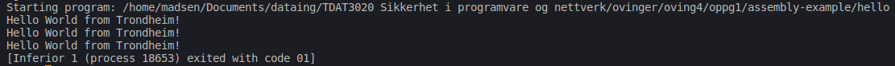
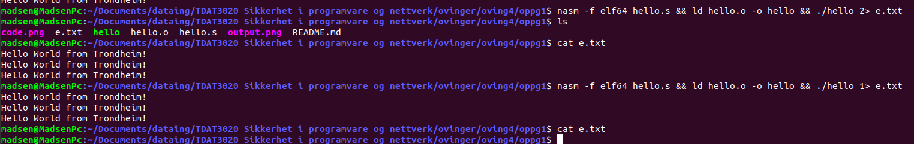

# Øving 4

# Oppgave 1

Endrer melding, lengde, og counter.



Exiter med kode 1.

Hvis vi piper med file descriptor 2 får vi output.




# Oppgave 2

## Replace text in C, C++ and Rust

## C

> gcc main.c -o main && ./main

```
Test & < > &&& <<><>> &>

output: Test &amp &lt &gt &amp&amp&amp &lt&lt&gt&lt&gt&gt &amp&gt
```

## C++

> g++ main.cpp -o main && ./main

```
Enter text: <><>&&>>&&<<

output: &lt;&gt;&lt;&gt;&amp;&amp;&gt;&gt;&amp;&amp;&lt;&lt;
```

## Rust

> rustc main.rs && ./main

```
Enter text: <<<<>>>>&&&&heisann>>

output: &lt;&lt;&lt;&lt;&gt;&gt;&gt;&gt;&amp;&amp;&amp;&amp;heisann&gt;&gt;
``` 
# Oppgave 3

Ved å oppdatere det dynamiske biblioteket trenger man ikke å kompilere c_exmaple igjen.

```sh
gcc -c -fPIC a_function.c more_functions.c 
gcc -shared a_function.o more_functions.o -o libfunctions.so
sudo cp libfunctions.so /usr/lib    
```

Når vi kjører programmet nå vil `caled` bli `called` :)
