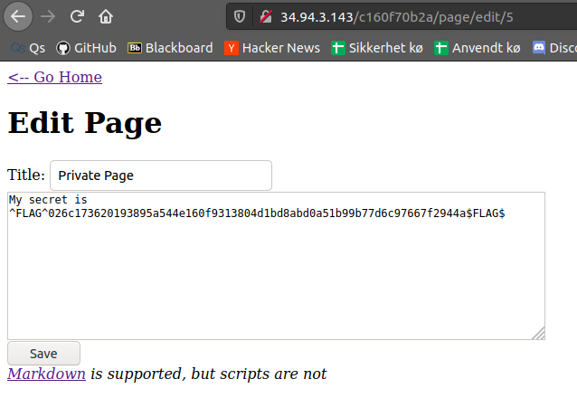
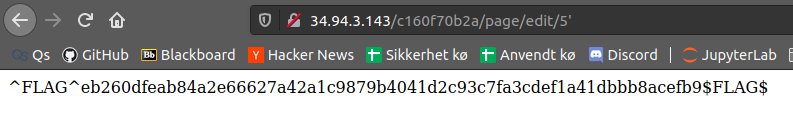
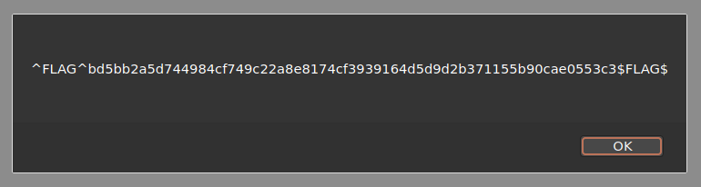
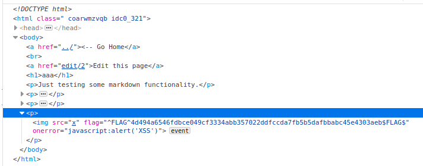

# Ghidra


```c
undefined8 main(void)

{
  char local_28 [32];
  
  printf("Enter your name: ");
  fgets(local_28,0x20,stdin);
  printf("Hello ");
  printf(local_28);  // <-- unsafe
  putchar(10);
  return 0;
}
```


On the `printf(local_28)` we print user input, this is not safe. could be replaced with: `fprintf("%s", local_28)`

# CTF

## Flag 1

We have 2 pages, indexed 1 and 2. Creating a new page gives us the id 8.

After seeing this i looked thru the other id's, where most gave 404, id 5 gave 403.

This page was restriced and did not show up on `page/5`, however by editing a other page and editing the url to `page/edit/5` I was able to see the flag.



## Flag 2

Appending a `'` to the previous url gave me a flag in plaintext.



## Flag 3

Markdown scrubbs `<script>` tags, but the title doesnt.

Creating a page with title `<script  src="alert('h')" />` and returning to the main page alerts us with the flag



## Flag 4

Creating a markdown image with `` tag and a binary xss alert resulted in a flag being put on the html element

```html

```


