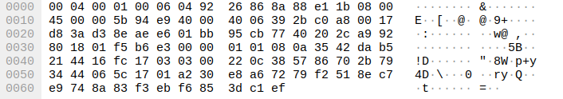

# Øving 11 - Mail

## Oppgave 1

### A)

`nslookup -q=mx google.com`

gir oss ip addressen: 216.58.244.142

Da jeg sender en mail via Gmail kan vi se denne pakken:



Som går fra min ruter til google sin ip.

Innholdet av pakkene er kryptert med SSL, det er derfor ikke mulig å se meldingen.

### B)

Det er i utgangspunktet mulig å se passordet i mailen, men dersom dette blir sendt over SSL er det kryptert.

## Oppgave 2

Ved å kjøre `./epostsjekk google.com` får vi:

```
Checking email at: google.com

Server ip:
172.217.20.46
172.217.20.46
2a00:1450:400f:809::200e

Mail server:
 - alt2.aspmx.l.google.com.     IPv4: 74.125.28.26      IPv6: 2607:f8b0:400e:c04::1b
 - aspmx.l.google.com.          IPv4: 74.125.205.26     IPv6: 2a00:1450:4010:c02::1b
 - alt3.aspmx.l.google.com.     IPv4: 173.194.201.26    IPv6: 2607:f8b0:4003:c0e::1a
 - alt1.aspmx.l.google.com.     IPv4: 108.177.97.27     IPv6: 2404:6800:4008:c00::1a
 - alt4.aspmx.l.google.com.     IPv4: 209.85.146.27     IPv6: 2607:f8b0:4001:c1f::1b

SPF:
FOUND

Include & Redirect:
_spf.google.com
_netblocks3.google.com
ip4:172.217.0.0/19
ip4:172.217.32.0/20
ip4:172.217.128.0/19
ip4:172.217.160.0/20
ip4:172.217.192.0/19
ip4:172.253.56.0/21
ip4:172.253.112.0/20
ip4:108.177.96.0/19
ip4:35.191.0.0/16
ip4:130.211.0.0/22
```

For statoil.no

```
Checking email at: statoil.no

Server ip:
140.86.60.34
140.86.60.34

Mail server:
 - statoil-no.mail.protection.outlook.com. IPv4: 104.47.10.36      IPv6: 104.47.10.36        

SPF:
FOUND

Include & Redirect:
spf.protection.outlook.com
ip4:40.92.0.0/15
ip4:40.107.0.0/16
ip4:52.100.0.0/14
ip4:104.47.0.0/17
ip6:2a01:111:f400::/48
ip6:2a01:111:f403::/48
spfd.protection.outlook.com
ip4:51.4.72.0/24
ip4:51.5.72.0/24
ip4:51.5.80.0/27
ip4:51.4.80.0/27
ip6:2a01:4180:4051:0800::/64
ip6:2a01:4180:4050:0800::/64
ip6:2a01:4180:4051:0400::/64
ip6:2a01:4180:4050:0400::/64
```

For ibm.com

```
Checking email at: ibm.com

Server ip:
129.42.38.10
129.42.38.10

Mail server:
 - mx0b-001b2d01.pphosted.com.  IPv4: Address:          IPv6: 127.0.0.53#53       
 - 148.163.158.5                IPv4:                   IPv6:                     
 - mx0a-001b2d01.pphosted.com.  IPv4: Address:          IPv6: 127.0.0.53#53       
 - 148.163.156.1                IPv4:                   IPv6:                     

SPF:
FOUND

Include & Redirect:
ip4:148.163.158.5
ip4:148.163.156.1
ip4:67.231.145.127
ip4:67.231.153.87
ip4:168.245.101.145
_spf.google.com
_netblocks3.google.com
ip4:172.217.0.0/19
ip4:172.217.32.0/20
ip4:172.217.128.0/19
ip4:172.217.160.0/20
ip4:172.217.192.0/19
ip4:172.253.56.0/21
ip4:172.253.112.0/20
ip4:108.177.96.0/19
ip4:35.191.0.0/16
ip4:130.211.0.0/22
```

