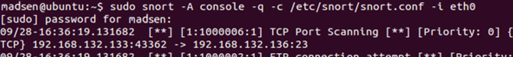

# Øving 13

I denne øvingen valgte jeg å bruke tripwire og snort

Tripwire ble konfigurert etter denne guiden:

https://www.howtoforge.com/tutorial/how-to-monitor-and-detect-modified-files-using-tripwire-on-ubuntu-1604/

Snort ble konfigurert til å detektere nmap ved å legge til denne linjen i local.rules

```
alert tcp any any -> $HOME_NET 23 (msg:”TCP Port Scanning”; sid:1000006; rev:1;)
``` 

## HIDS

Tripwire

> sudo tripwire --check

```sh
===============================================================================
Object Summary: 
===============================================================================

-------------------------------------------------------------------------------
# Section: Unix File System
-------------------------------------------------------------------------------

No violations.

===============================================================================
Error Report: 
===============================================================================

No Errors
```
> sudo touch newFile.txt

> sudo tripwire --check

```sh
===============================================================================
Object Summary: 
===============================================================================

-------------------------------------------------------------------------------
# Section: Unix File System
-------------------------------------------------------------------------------

-------------------------------------------------------------------------------
Rule Name: Other configuration files (/etc)
Severity Level: 66
-------------------------------------------------------------------------------

Added:
"/etc/newFile.txt"

Modified:
"/etc"

===============================================================================
Error Report: 
===============================================================================

No Errors
``` 

## NIDS

Tester nmap mot snort over lokalt nettverk.

> sudo snort -A console -q -c /etc/snort/snort.conf -i eth0


