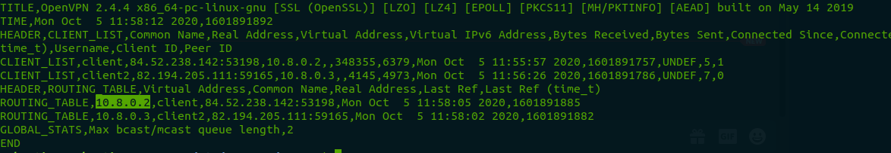
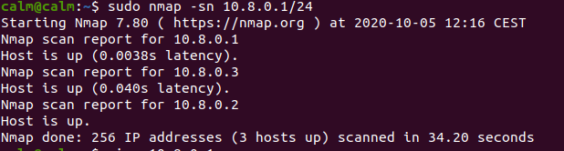
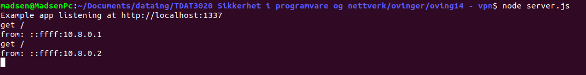

# Øving 15 - VPN

Jakob Madsen, Pascal Pickel og Sebastian Ikin.

## Guide

https://www.cyberciti.biz/faq/ubuntu-18-04-lts-set-up-openvpn-server-in-5-minutes/

 

# Server

> sudo systemctl start openvpn-server@server.service 

Her ser vi `client` og `client2` er koblet til og får hver sin ip:

`10.8.0.2` og `10.8.0.3`

 

# Klient

## Kobler til VPN

> openvpn -client --config client.ovpn

> sudo systemctl start openvpn@client

 

## Scanner lokalt nettet til vpn host

 

## Hoster http server

Hoster en enkel server som printer ip på 10.8.0.3

