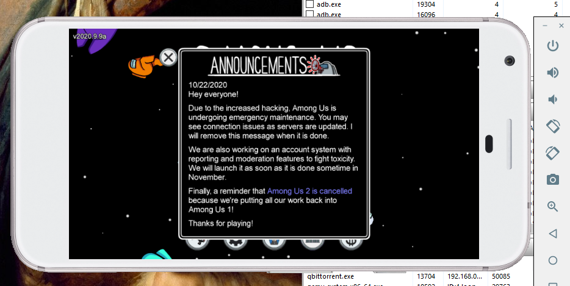
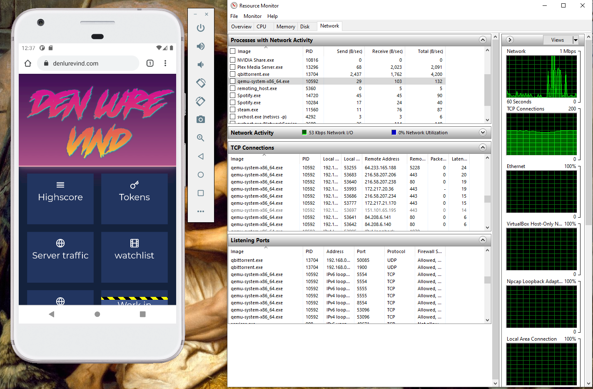
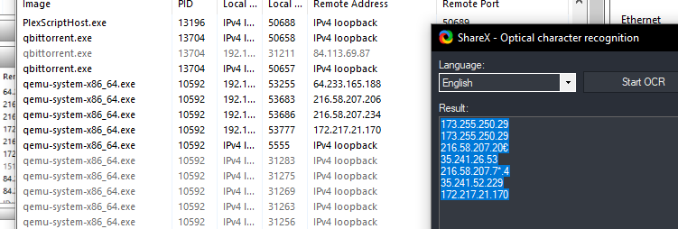
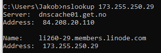
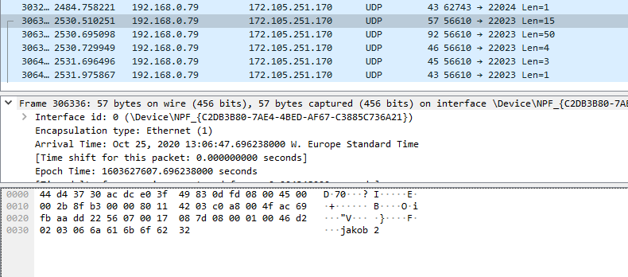
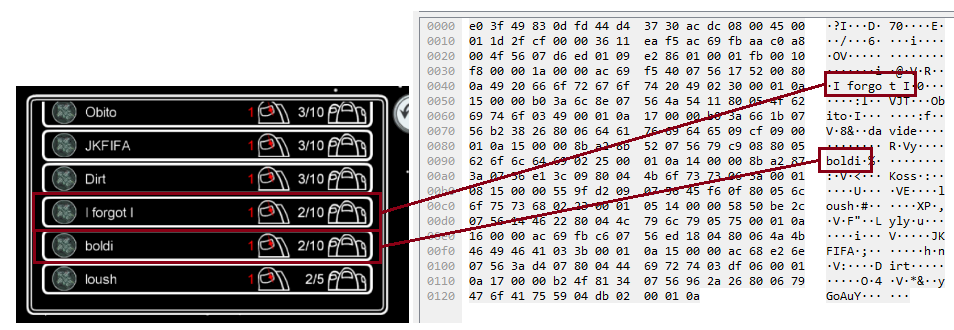
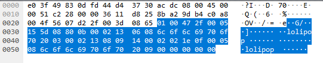
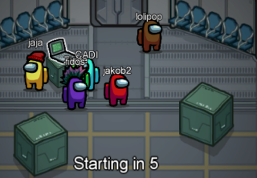
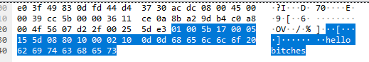
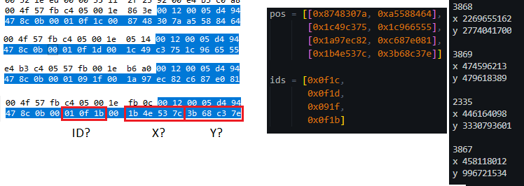

# Øving 21 - Game Expolit

``` 
Finne mulige problemer i en fritt valgt nettverksprotokoll

Det er etterhvert mye programvare som kommuniserer over nett, ofte mot en sen-tral server eller skytjeneste. 

Bruk pakkesniffer, se om dere kan finne ut nok omen slik kommunikasjonsprotokoll til å ihvertfall kunne foreslå hvordan den kantrikses med.Ta f.eks. et eller annet mobil-spill. 

Se på hva som overføres, se om dere finnernoe dere kjenner igjen fra spillet. Hvis dere kunne endre kommunikasjonen fritt, kunne dere f.eks. skaffet fordeler i spillet, eller jukset med highscore-lista?

Ser dere noe mottiltak?
```

# Among Us

Starter en Virtuell Android Emulator.

Installerer Among Us APK

Da jeg starter spillet får jeg melding om at det er mange hackers som spiller...



Starter med å lage et brukernavn


Da jeg er på windows bruker jeg Resource Monitor til å se alle koblingene til emulator prosessen



Jeg tar dermed nslookup for å se om det er noen interresante ip'er





En Ip skiller seg ut da dette er hosten til en populær spill side

> li260-29.members.linode.com

Da jeg starter wireshark interface med filter:

> ip.dst == 172.105.251.170 || ip.src == 172.105.251.170 

Finner jeg en pakke som inneholder mitt navn



Da jeg åpner server lista får jeg også en plaintext pakke med alle instances.



Men da jeg kobler til en server slutter all trafikken, selve spillet anvender en annen server enn lobbyen.

Da jeg joiner en server holder jeg øye på hvilke nye Ip'er som dukker opp i Resource manager.

Inne i lobbyen er det andre spillere som kommer inn fortløpende, jeg fant igjen en pakke med navnet til en ny spiller.



Vi ser her at navnet `lolipop` er på vei inn.

Ikke lenge etter dukker det opp en spiller med det navnet.



Vi har også tilgang til å chatte med hverandre via ingame chat.



Etter å analysere pakkene ser det ut som spillet bruker "ticks", posisjonen til alle spillerene blir oppdatert på et gitt interval. Ved å se på alle pakkene ser vi et klart mønster. De inneholder antaglivis spiller id og posisjon.

Dersom vi gjør hex dataen om til tall før vi noe som kan se ut som x og y verdier.



Hvis serveren ikke autentiserer denne informasjonen kan man i teorien teleportere rundt på kartet. En fiks på dette hadde vært å sjekke ny posisjon mot gammel posisjon, dersom det ikke er mulig å komme seg fra A til B på en gitt tid kan man si at spilleren jukser.

# Konklusjon

Dersom dette spillet har økt i popularitet har de økt fokuset på å sikre serverside autentisering slik at det er vanskelig for en klient å påvirke spillet.

Men man kan se flere eksempler på dette i det siste hvor noen har klart å få andre i spillet til å sende meldinger.


