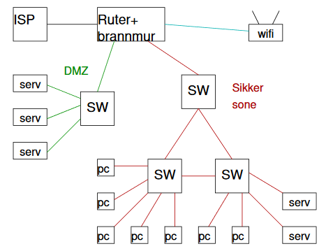

# Øving 23

# Oppgave 1

## a )

Multiconsult:
- Bedre lås på døren.
- Låse pcen inn i skap eller med Kensington lås.

Barclays:
- Sjekke at folk som sier de jobber på banken faktisk jobber der.
- Låse inn rutere og lignende utstyr.
- Kryptere all nettverkstrafikk

## b )

Multiconsult:
- All data på pcen slettes dersom pcen blir stjålet.
- Backup av all data.
- Kryptering av data.
- GPS på pcen så den kan bli funnet igjen dersom den ikke er helt ødelagt.

Barclays:
- Bruke 2 faktor autentisering, slik at de ikke kan overføre penger selv med brukernavn og passord.
    - f.eks. en engangskode/YubiKey for hver ansatt

# Oppgave 2

## Stuxnet

Stuxnet er en dataorm som ble brukt i hovedsak mot Irans atomvåpen prosjekt.

Stuxnet er antatt å ha ødelagt en femtedel av alle atom sentrifugene og infiltrert 200000 PCer og ødelagt 1000 PCer.

### Dataormen ble overført til systemer via USB brikker.

Hvis jeg var ansvarlig for sikkerheten på disse anleggene ville jeg banlyst alle ukjente USB brikker. Dersom noen skulle brukt det måtte de først sjekket de på en virtuell/sandkasse maskin som var utenfor resten av systemet.

Man burde kun behandle filer som man selv er kjent med og sjekke at de ikke har blitt endret på med hjelp av checksum.

# oppgave 3

## Problemer

- Alle PCer, filtjenere, web- og epost-tjenere er på samme nettverk.
    - Web og epost skal være offentlig med ikke resten av nettverket.
    - Siden konkurrenten har lik side tyder det på at de har fått tilgang til nettet.
    - Taper anbud pga spionasje.
- Ingen vet hvilke brannmur regler som er på plass.
    - Brannmuren kan være utdatert og ha dårlige regler.
- Kunder har tilgang til bedriftnettet.
- Programmerer har satt opp nettverk.
    - Burde ansette noen som har peiling på nettverksikkerhet.
    - Ikke anta at programmerer kan alt om IT.
- Felles dropbox for sensitiv data.
    - Burde bruke egen filserver da filene kan forsvinne om Dropbox legger ned.
    - https://www.digi.no/artikler/ikt-professor-utestengt-fra-microsoft-konto-fortviler-etter-a-ha-mistet-adgang-til-1-terabyte-onedrive/501597
- Inviterer kunder til dropbox.
    - Kunder får tilgang til sensitiv data.
- Serveren er under en varmtvannstank.
    - ...
- Ingen backup av kvitteringer.
- Dårlig opplæring av ansatte for trygg IT bruk.

## Sikkerhetstiltak
- Sikre nettverk:
    - Ytre brannmur
    - Gjestenett
    - Opprette DMZ for eksterne tjenester 
        - webserver
        - epostserver
    - Indre brannmur
        - ansatt nettverk

- Brannmur
    - Oppdatere regler
    - Følge oppdelingen nevnt over
- Felles dropbox
    - Bytte til egen filserver
        - Kan ha en offentlig filserver for brosjyrer
        - Privat filserver for sensitiv data
    - Ikke la kunden få tilgang til sensitiv data
- Flytte serveren
    - Vekk fra vann
    - Låses inn i serverrom
- Backup av data
    - Backup på egen filserver
    - Backup på en sikker ekstern tjeneste
- Oppgradere server
    - Slik at Bob Kåre ikke syntes den er treg og sender sensitiv data.
- Opplæring av ansatte
    - Ansatte må lære hva konsekvensen av valgene de gjør har

## Sikkerhetspolicy

- Kun IT personell skal endre på nettverk.
- _Ikke_ send sensitiv data på mail eller dropbox.
- _Ikke_ gi nettverk passord til kunder.
- _Ikke_ ta i bruk ukjente USB brikker.
- _Ikke_ last ned ukjent programvare.
- _Ikke_ åpne phising mail.

## Brannmur
- Generelt
    - Fail2Ban
    - Stoppe ugyldige adresser
        - Eksterne pakker med intern sender
    - Stoppe ugyldige pakker
        - SYN+FIN
    - Stoppe uønskede protokoller
        - utgående trafikk
            - MS RPC
            - SMB (wannacry brukte denne)
            - TFTP
            - SNMP
    - Filtrere spam eposter
- Ytre brannmur
    - web- og epost-tjener på portene:
        - 587 kryptert Mail
        - 80 HTTP    (redirecte til 443)
        - 443 HTTPS
- Indre brannmur
    - Drop alt av "inbound" trafikk
    - kun få svar på port 53 (udp, tcp)

