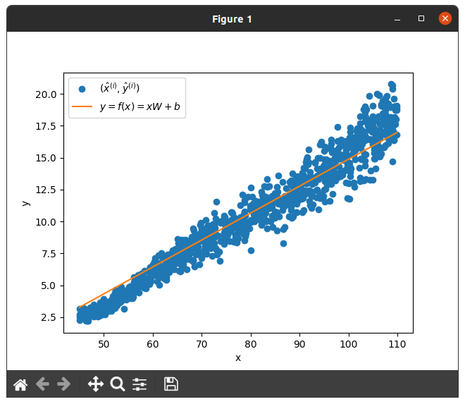
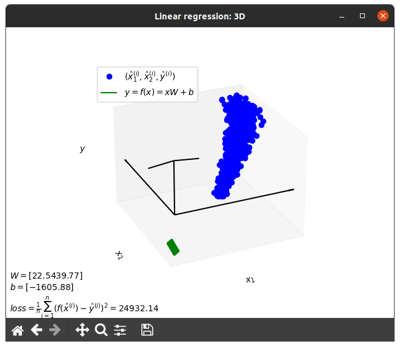
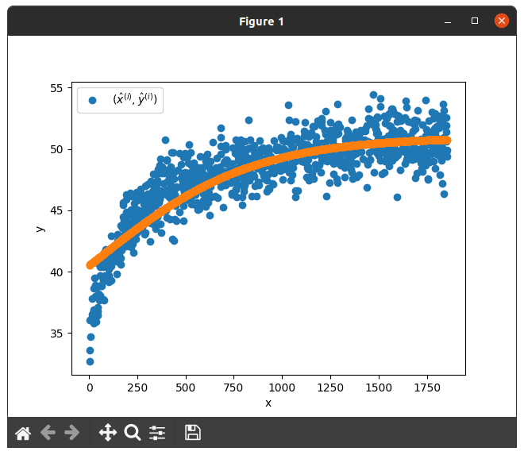

# Linear Regression

## Task 1

Learning rate = 0.0001

Epochs = 120 000

Loss = 1.2833

## Task 2

Learning rate = 0.0001

Epochs = 500_000

Loss = 55k

## Task 3

Learning rate = 0.000001

Epochs = 80_000

Loss = 2.7056

