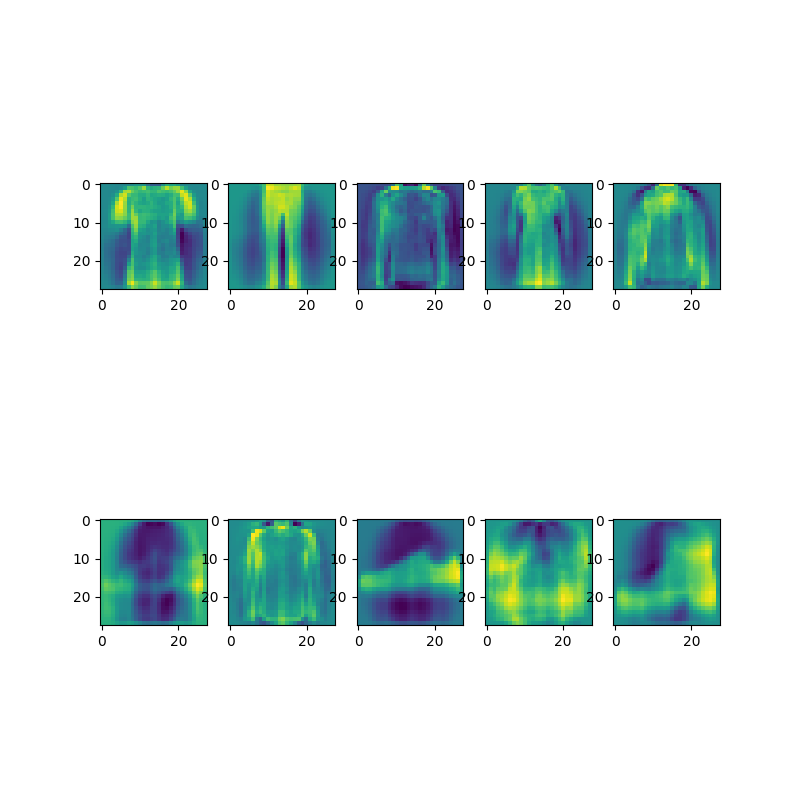

# Øving 3 - Convolutional neural networks

Eksempel kode 
Accuracy: 0.9794

## Oppgave A

Accuracy: 0.9840

## Oppgave B

Accuracy: 0.9831

## Oppgave C

Accuracy w/ ReLU: 0.9887

## Oppgave D

Accuracy: 0.9001

