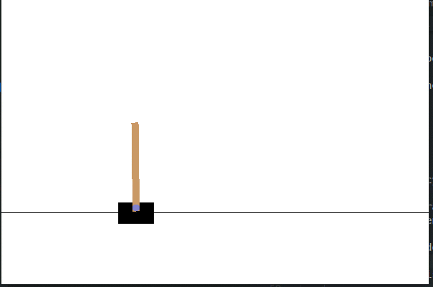
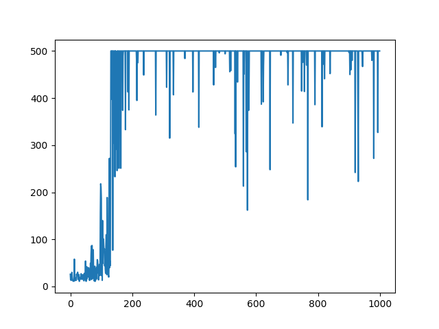
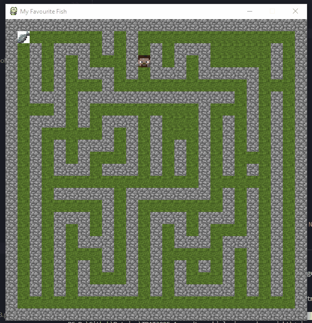
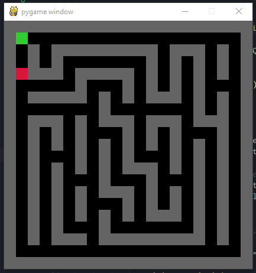
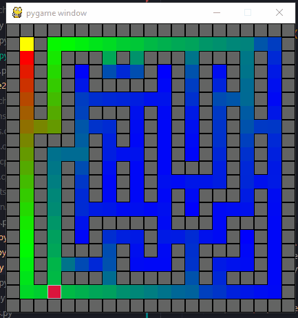

# Øving 8 - Reinforcement learning

Jakob Lønnerød Madsen

## Oppgave 1

 

1000 episoder

- y = tid i live

- x = episode nr

 

## Oppgave 2

 

|               |           |                       |
|---------------|-----------|-----------------------|
| Alpha       	| 0.1   	|                    	|
| Gamma       	| 0.95  	|                    	|
| Epsilon     	| 1     	| minker per episode 	|
| Episoder    	| 3000  	|                    	|
| Max steps   	| 100   	|                    	|
|             	|       	|                    	|

 

Heatmap:

- blå, lite score

- grønn, mer score

- rød, masse score

